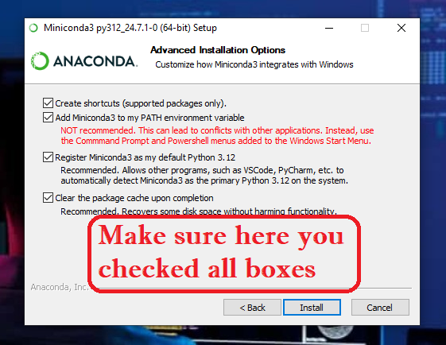
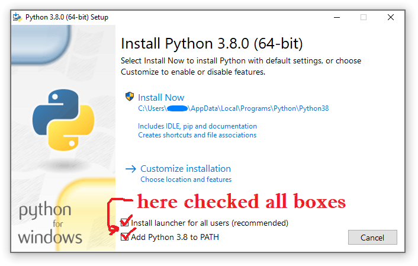
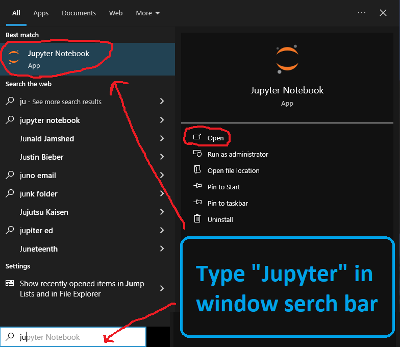

# Guide to Install Jupyter with TensorFlow on Windows 10

## Prerequisites
1. **Install Miniconda**: Ensure you have Miniconda installed on your system. You can download it from [here](https://docs.conda.io/en/latest/miniconda.html).


3. **Download & Install Python Latast Version**: From [here](https://www.python.org/downloads/).


## [**Video Guide for Window users: https://youtu.be/F7qWmFOuevE?si=WyXGRN3cCpbHnQrr**](https://youtu.be/F7qWmFOuevE?si=WyXGRN3cCpbHnQrr)

## Step-by-Step Instructions
Note: If you found any Error like "Connection Bronken" then you just rewrite commond & excute it until you successfully downlaoad or create environment.

### 1. Create a New Conda Environment
Since TensorFlow does not support Python 3.12, we'll create a new environment with Python 3.10.

Open the Command Prompt and run:
```bash
conda create --name tensorflow_env python=3.10
```

### 2. Activate the Environment
After the environment is created, activate it:
```bash
conda activate tensorflow_env
```

### 3. Install Jupyter and Dependencies
Once the environment is activated, install Jupyter and the necessary libraries. Run:
```bash
conda install jupyter scikit-learn scipy pandas pandas-datareader matplotlib pillow tqdm requests h5py pyyaml flask boto3
```

### 4. Install TensorFlow
Now, install TensorFlow. For CPU-only installation, run:
```bash
pip install tensorflow-cpu
```

### 5. Install Jupyter Kernel
A new Jupyter kernel points to a specific Python environment. Here’s how to create one for your `tensorflow_env` environment:
Make sure to activate your `tensorflow_env` environment:
          
#### (1) Install ipykernel
If you haven't already installed `ipykernel`, do so by running:
```bash
pip install ipykernel
```
            
#### (2) Add the Kernel to Jupyter
Run the following command to add the kernel to Jupyter, adjusting the name and display name as needed:
```bash
python -m ipykernel install --user --name tensorflow_env --display-name "Python 3.10 (tensorflow_env)"
```
This command creates a new kernel associated with your `tensorflow_env` environment.
            
#### (3) Launch Jupyter Notebook
After adding the kernel, launch Jupyter Notebook:
```bash
jupyter notebook
```
            
#### (4) Select the New Kernel
When you create a new notebook, you should see "Python 3.10 (tensorflow_env)" as an option. Select this kernel for your notebook to use the TensorFlow environment.

### 6. Verify Installation
In the notebook, you can run the following code to check TensorFlow:
```python
import tensorflow as tf
print(tf.__version__)
```

## Launh jupyter Notebook Whenever
#### After successfully completing the installation, whenever you want to run Jupyter Notebook, just follow these steps
### Method 1: Search "jupter" in window search_bar and single click to open it


### Method 2: You can also open jupyter through commond line
Make sure to activate your `tensorflow_env` environment:
```bash
conda activate tensorflow_env
```
Run Jupyter Notebook in the enviorment:
```bash
jupyter notebook
```

## Conclusion
You should now have a fully functional Jupyter environment with TensorFlow on your Windows 10 system!
