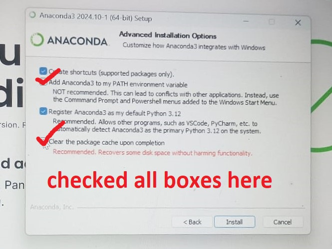

# Master Guide to Install Jupyter Notebook with CPU-Only TensorFlow on Windows 11

This is a step-by-step guide for installing Jupyter Notebook and TensorFlow (CPU-only) on Windows. I’ll break it down into clear, essential steps with each command highlighted.

---

## Step 1: Install Anaconda

1. **Download and Install Anaconda**
   - Visit the Anaconda website and download the installer for Windows. [Click here](https://www.anaconda.com/download)
   - During setup, select the option to **Add Anaconda to my PATH environment variable**. 
   - Complete the installation.

2. **Test Anaconda Installation**
   - Open Command Prompt and type:
     ```cmd
     conda --version
     ```
   - You should see the version number if installed correctly.

---

## Step 2: Create a Conda Environment for TensorFlow

1. **Open Anaconda Prompt**
   - Find it in the Start Menu after installing Anaconda.

2. **Create Environment**
   - Run this command to create an environment named `tensorflow_cpu` with Python 3.8:
     ```cmd
     conda create -n tensorflow_cpu python=3.8
     ```

3. **Activate the Environment**
   - Enter the environment with:
     ```cmd
     conda activate tensorflow_cpu
     ```

4. **Verify Python Version**
   - Check that the environment has the correct Python version:
     ```cmd
     python --version
     ```
   - This should display Python 3.8.

---

## Step 3: Install Jupyter Notebook

1. **Install Jupyter Notebook in the Environment**
   - With the `tensorflow_cpu` environment active, install Jupyter:
     ```cmd
     conda install jupyter
     ```

2. **Test Jupyter Notebook**
   - Start Jupyter Notebook to confirm installation:
     ```cmd
     jupyter notebook
     ```
   - This should open a new browser tab with Jupyter’s interface. Close it after confirming.

---

## Step 4: Install CPU-Only TensorFlow

1. **Install TensorFlow**
   - In the `tensorflow_cpu` environment, install the CPU version of TensorFlow:
     ```cmd
     pip install tensorflow-cpu
     ```

2. **Verify TensorFlow Installation in Jupyter**
   - Open Jupyter Notebook by typing:
     ```cmd
     jupyter notebook
     ```
   - Create a new Python 3 notebook and test TensorFlow by entering this code in a cell:
     ```python
     import tensorflow as tf
     print("TensorFlow version:", tf.__version__)
     print("GPU available:", tf.config.list_physical_devices('GPU'))
     ```
   - This should display the TensorFlow version and `[]` for GPU, confirming CPU-only usage.

---

## Step 5: Set Up the Environment as a Jupyter Kernel (Optional)

1. **Install `ipykernel` in Environment**
   - Still in the `tensorflow_cpu` environment, install `ipykernel`:
     ```cmd
     pip install ipykernel
     ```

2. **Add the Environment to Jupyter**
   - Register `tensorflow_cpu` as a Jupyter kernel:
     ```cmd
     python -m ipykernel install --user --name tensorflow_cpu --display-name "Python (tensorflow_cpu)"
     ```

3. **Select the Kernel in Jupyter Notebook**
   - Start Jupyter Notebook again:
     ```cmd
     jupyter notebook
     ```
   - In a new notebook, go to **Kernel > Change Kernel** and select **Python (tensorflow_cpu)**. This ensures you’re using the environment with TensorFlow installed.

---

This guide covers each step you need for setting up TensorFlow with Jupyter Notebook in an isolated environment.
